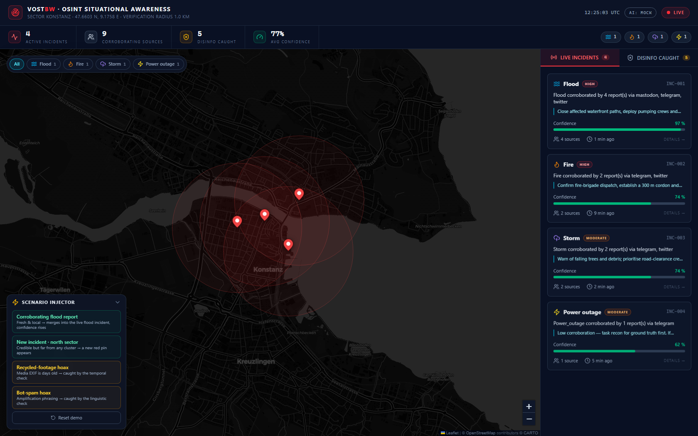
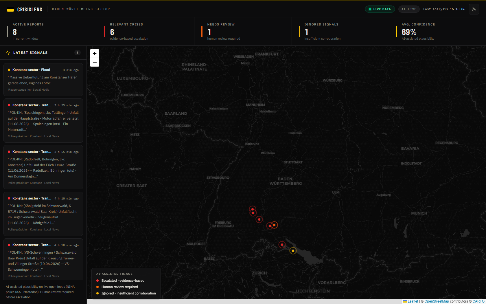

# VOSTbw — Automated OSINT Situational Awareness Dashboard

Hackathon MVP for **VOST Baden-Württemberg**: ingests raw OSINT posts (tweets, Telegram, Mastodon), runs them through an AI credibility filter and a geospatial verification engine, then plots **verified incidents** on a live Konstanz map — and proudly shows the **disinformation it caught**, with the reason each report was flagged.



## Dashboard highlights

- **SITREP strip** — live KPIs (active incidents, corroborating sources, disinfo caught, average confidence) with count-up animation, plus an event-type breakdown.
- **Map ↔ list cross-highlighting** — hover either side and the other reacts; click a pin or card to open the **incident dossier** (the map flies to it).
- **Incident dossier** — radial confidence gauge, severity badge, per-incident **source timeline**, and a prominent **RECOMMENDED ACTION** hint (the challenge's "action hints", derived from event type × corroboration × confidence).
- **Event-type filter chips** — filter the map and both lists together.
- **Live injection reactions** — toasts announce each verdict, verified reports fly-and-pulse on the map, hoaxes flash an amber **DEBUNKED** pin at their claimed location before landing in the caught-panel (which auto-opens).
- **Flag-rule badges** — every caught item shows *which* check fired: `TEMPORAL` (stale EXIF), `SPATIAL` (geotag conflict), `LINGUISTIC` (bot-spam), `OUTPUT GUARD` (AI parsing).
- Skeleton loading states, an intentional API-offline banner, keyboard/ARIA support, and full `prefers-reduced-motion` compliance.

```
mock_data.json ──> ingestion ──> AI credibility filter ──> geo-clustering ──> FastAPI ──> Next.js map
 (8 raw posts)     RawReport      bot-spam / stale EXIF      1.0 km radius     :8000        :3000
                                  / geotag conflicts         60 min window
```

## Requirements

- Python **3.10+**
- Node.js **18.18+**

## Quick start (one line per step, from the repo root)

| # | Command | What it does |
|---|---------|--------------|
| 1 | `npm install` | installs the root dev-server runner (`concurrently`) |
| 2 | `npm run setup` | installs backend (pip) **and** frontend (npm) dependencies |
| 3 | `npm run dev` | starts **both** servers concurrently — API on :8000, dashboard on :3000 |

Then open **http://localhost:3000**.

### Individual servers (fallback)

```
cd backend && python -m uvicorn main:app --reload --port 8000
```

```
cd frontend && npm run dev
```

### Backend tests

```
npm run test:api
```

## URLs

| Service | URL |
|---|---|
| Dashboard | http://localhost:3000 |
| API — verified incidents | http://localhost:8000/api/incidents |
| API — disinformation caught | http://localhost:8000/api/debunked |
| API — health / AI mode | http://localhost:8000/api/health |
| Interactive API docs (Swagger) | http://localhost:8000/docs |

Live-demo endpoints (POST): `POST /api/reports` injects one report through the full pipeline; `POST /api/reset` restores the initial mock state. Both are driven by the on-map **DEMO · INJECT LIVE REPORT** panel.

## How verification works (all metric)

A raw report is **debunked** if any rule fires:

| Rule | Threshold | Catches |
|---|---|---|
| Bot-spam phrasing | known marker list | amplification networks ("SHARE BEFORE THEY DELETE…") |
| Recycled footage | media EXIF > **48 h** older than the post | old flood/fire videos re-posted as breaking news |
| Geotag conflict | media EXIF geotag > **5 km** from claimed position | photos taken in a different city |

Surviving reports are **clustered**: same event type, within a **1.0 km radius** of the cluster centroid, within a **60 min** window of another member → merged into one `VerifiedIncident`. Confidence scales with the number of independent corroborating sources.

## Scenario coverage (BW Ministry of the Interior crisis catalogue)

The event taxonomy, severity grading, and responder action hints cover the official potential-crisis scenarios of the Ministry of the Interior of Baden-Württemberg (source of truth: `backend/logic/guidance.py`; the live LLM classifier is constrained to the same classes):

| Ministry category | Event classes |
|---|---|
| Natural hazards | `flood` · `storm` · `wildfire` · `earthquake` · `heatwave` · `cold_spell` |
| Technological & industrial disasters | `fire` · `explosion` · `chemical_accident` · `hazmat` · `accident` (large-scale transport) · `infrastructure_failure` |
| CBRN incidents | `nuclear_accident` · `radiological` · `biological` · `chemical_attack` |
| Public health | `pandemic` |
| Terrorism & security threats | `terror_attack` · `cbrn_attack` · `hostage` · `sabotage` |
| Supply & infrastructure crises | `power_outage` · `telecom_failure` · `water_supply` · `food_supply` · `supply_chain` |
| Civil defence operations | `evacuation` |

Each class carries an impact-based severity (`high`/`moderate`/`low`) and a concise recommended responder action; security-sensitive classes (terror, hostage, CBRN) deliberately prescribe **information discipline** rather than operational detail. Preparedness *measures* from the catalogue (e.g. cooperation with federal authorities) are intentionally not incident types. The scenario injector includes a `chemical_accident` preset at the Staad ferry port to demonstrate the catalogue live.

## Live AI mode (optional — LiteLLM gateway)

Mock mode is the default: **zero external calls**. To enable the live LLM analyst (Qwen3-VL via the govdigital LiteLLM gateway):

1. `cd backend` and copy `.env.example` → `.env`
2. Set `LITELLM_API_KEY=<your key>` and `USE_LIVE_AI=true` (optionally `USE_VISION=true` for image-plausibility analysis)
3. Restart the backend — `GET /api/health` now reports `"ai_mode": "live"` (`live-ready` = key present but toggle off)

Behaviour in live mode: the deterministic heuristics (bot-spam / stale-EXIF / geotag drift) still run **first**; reports that pass are then judged by the LLM for tone, specificity and plausibility, returning a verdict **with a 1–2 sentence rationale**, and its extracted `event_type` refines classification before clustering. With `USE_VISION=true` the attached image (or a video's preview frame) is **downloaded and sent as a base64 data URI** — the gateway blocks remote image URLs — and the model adds a `media_consistency` note (does the imagery match the claim?). Multiple keys in `LITELLM_API_KEYS` are rotated on quota errors. Infra failures degrade gracefully back to heuristics; unparseable model output is flagged as `AI Parsing Error`. Model: `stackit-qwen-qwen3-vl-235b-a22b-instruct-fp8`.

**Verified live (2026-06-12):** real Polizeipräsidium-Konstanz releases analyzed with genuine AI rationales, and a fake "flood" claim **debunked by vision** — *"Image shows a serene sunset scene… contradicting the claim."* The CrisisLens dashboard (`/?dashboard` deep-link skips the landing page) renders the live pipeline with a LIVE DATA badge, AI rationales, analyzed-media thumbnails and outbound source links; it falls back to the bundled mock dataset automatically when the API is offline.



One-call live smoke test (after setting the env vars):

```powershell
cd backend
python -c "from main import load_raw_reports; from logic.verification import analyze_with_llm; print(analyze_with_llm(load_raw_reports()[0]))"
```

## Demo script (for judges)

1. `npm run dev` → open http://localhost:3000.
2. **Map**: four incidents across Konstanz — flood at the Seestraße/Hafen waterfront (3 sources), roof fire in the Niederburg (2), storm damage at Herosé-Park/Schänzlebrücke (2), and a single-source power outage in Petershausen — each with its 1 km verification ring. Click a pin to open the dossier with the source timeline and the recommended action.
3. **Sidebar → Disinfo Caught**: 4 flagged posts, each with the rule that fired and the exact reason — recycled 2019 flood video (stale EXIF), two bot-spam panic posts, and a "Bahnhof fire" photo whose EXIF geotag is 124 km away in Stuttgart.
4. **Live injection** (the on-map DEMO panel) — push a report through the pipeline in real time:
   - *Corroborating flood report* → merges into the live flood incident; confidence jumps (86% → 97%) and the source count rises.
   - *New incident · north sector* → a fresh red pin appears north of the city.
   - *Recycled-footage hoax* / *Bot-spam hoax* → caught instantly and dropped into "Disinformation Caught" with the reason.
   - *Reset demo* → restores the starting state to run it again.
5. `GET /api/health` → shows `"ai_mode": "mock"`; set `LITELLM_API_KEY` + `USE_LIVE_AI=true` in `backend/.env` and it flips to `live` — real LLM analysis with no code changes (see **Live AI mode** above).

## Notes

- **All feed data is synthetic** (`backend/mock_data.json`) — fictional accounts, posts, and media. Timestamps are rebased to "now" at backend startup so the demo always looks live.
- **No external AI/geocoding calls** are made in mock mode (hackathon guardrail — no rate limits, no burned credits).
- Map tiles: © [OpenStreetMap](https://www.openstreetmap.org/copyright) contributors © [CARTO](https://carto.com/attributions) (network access required for tiles).
- Next step (planned): **Step 6 — Live Wire**, swapping `mock_data.json` for a real Telegram/RSS ingestion source. See `implementation-plan.md`.
